## Where I'm From
I grew up in Trinidad, a small coastal town in Humboldt County in 
Northern California. Growing up surrounded by redwood forests and 
the Ocean shaped the way I see the world and drew me toward 
Environmental Studies. I wanted to understand and protect the places 
that made me who I am.

## My Academic Journey
I'm currently a 3rd year at UC Santa Barbara, majoring in Environmental 
Studies with a minor in Education. For me, these two fields aren't 
separate but deeply connected. I want to go into environmental 
education and eventually teach in an outdoor school setting, bringing 
students into nature as a classroom.

## What Drives Me
I believe that understanding the environment isn't enough on its own and that we have to teach the next generation to care about it too. My goal is to become an environmental educator who connects ecological science with environmental justice, community, and place. I want students to see themselves as part of nature, not separate from it.


```{r}
#| echo: false
library(leaflet)

leaflet() |>
  addTiles() |>
  addMarkers(lng = -124.1400, lat = 41.0568, popup = "Trinidad, CA — Home") |>
  addMarkers(lng = -119.8489, lat = 34.4140, popup = "Santa Barbara, CA — UCSB")
```


## Places I've Traveled!
I love to travel and I am so grateful to have had the privilege and time to do so. I have had a lot of fun and new learning experiences in each place. Here are some of the places I've been. 

```{r}
#| echo: false
library(leaflet)

leaflet() |>
  addTiles() |>
  addMarkers(lng = -124.1400, lat = 41.0568, popup = "🏠 Trinidad, CA — Hometown") |>
  addMarkers(lng = -119.8489, lat = 34.4140, popup = "🎓 Santa Barbara, CA — UCSB") |>
  addMarkers(lng = -86.2419, lat = 12.1328, popup = "🌍 Nicaragua") |>
  addMarkers(lng = -83.7534, lat = 9.7489, popup = "🌍 Costa Rica") |>
  addMarkers(lng = -43.1729, lat = -22.9068, popup = "🌍 Rio de Janeiro, Brazil") |>
  addMarkers(lng = 2.1734, lat = 41.3851, popup = "🌍 Barcelona, Spain") |>
  addMarkers(lng = -9.1393, lat = 38.7223, popup = "🌍 Lisbon, Portugal") |>
  addMarkers(lng = -0.1276, lat = 51.5074, popup = "🌍 London, UK") |>
  addMarkers(lng = 4.9041, lat = 52.3676, popup = "🌍 Amsterdam, Netherlands") |>
  addMarkers(lng = 12.4964, lat = 41.9028, popup = "🌍 Rome, Italy") |>
  addMarkers(lng = 14.2681, lat = 40.8518, popup = "🌍 Naples, Italy") |>
  addMarkers(lng = -9.4162, lat = 38.9666, popup = "🌍 Ericeira, Portugal") |>
  addMarkers(lng = -106.3468, lat = 56.1304, popup = "🌍 Canada") |>
  addMarkers(lng = -157.8583, lat = 21.3069, popup = "🌍 Hawaii") |>
  addMarkers(lng = -102.5528, lat = 23.6345, popup = "🌍 Mexico") |>
  addMarkers(lng = 2.3522, lat = 48.8566, popup = "🌍 Paris, France") |>
  addMarkers(lng = -74.0060, lat = 40.7128, popup = "🌍 New York, USA") |>
  addMarkers(lng = -120.5542, lat = 43.8041, popup = "🌍 Oregon") |>
  addMarkers(lng = -120.7401, lat = 47.7511, popup = "🌍 Washington") |>
  addMarkers(lng = -116.4194, lat = 38.8026, popup = "🌍 Nevada") |>
addMarkers(lng = 21.8243, lat = 39.0742, popup = "🌍 Greece") |>
  addMarkers(lng = -105.8701, lat = 34.5199, popup = "🌍 New Mexico") |>
  addMarkers(lng = -105.7821, lat = 39.5501, popup = "🌍 Colorado")

```


## Photos from travels!

```{=html}
<div style="display: grid; grid-template-columns: repeat(4, 1fr); gap: 4px;">
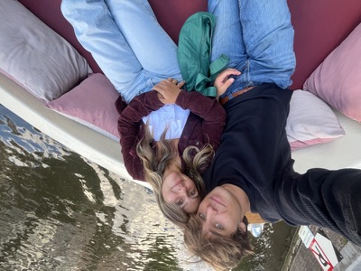
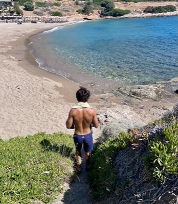
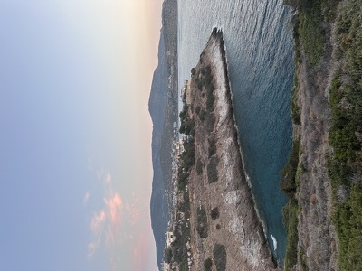
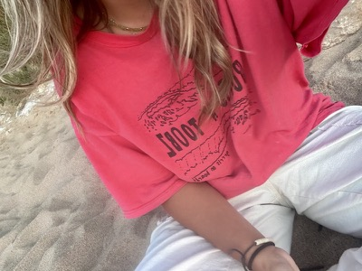
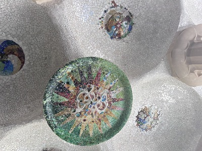

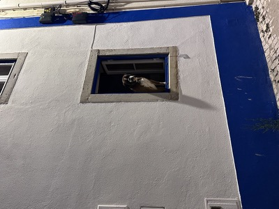
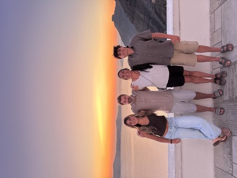
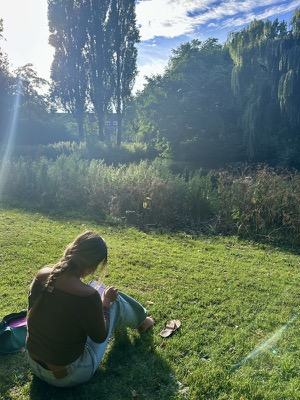
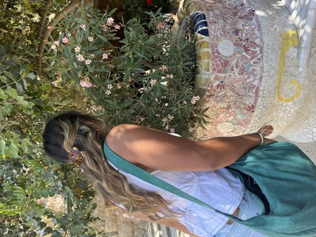
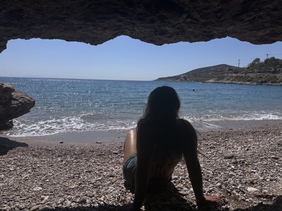
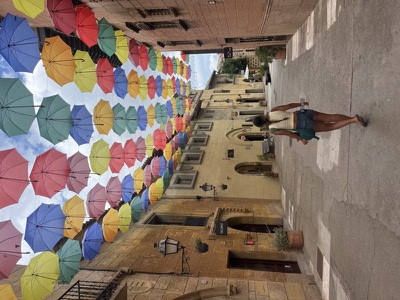
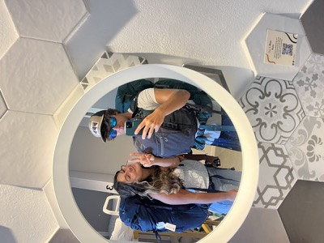
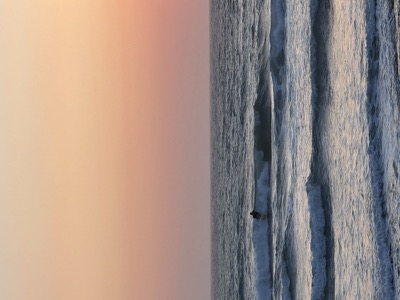
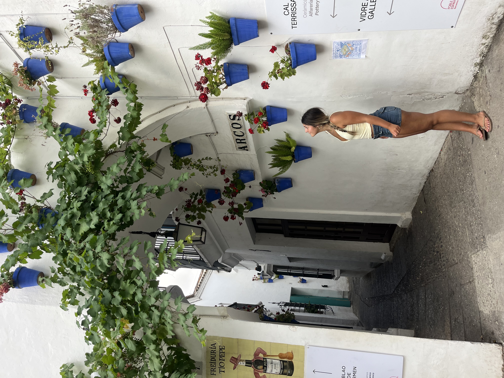
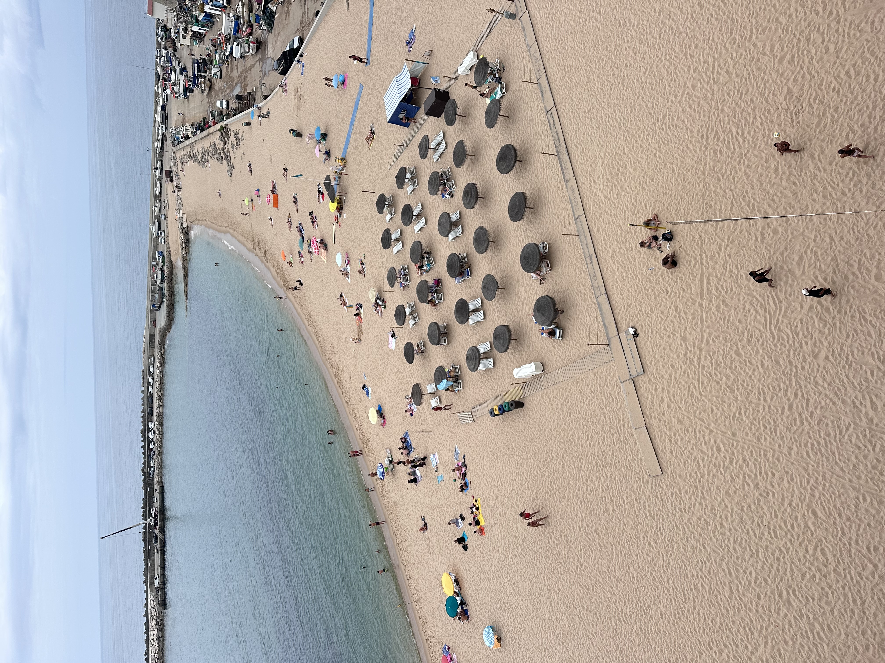
</div>
```