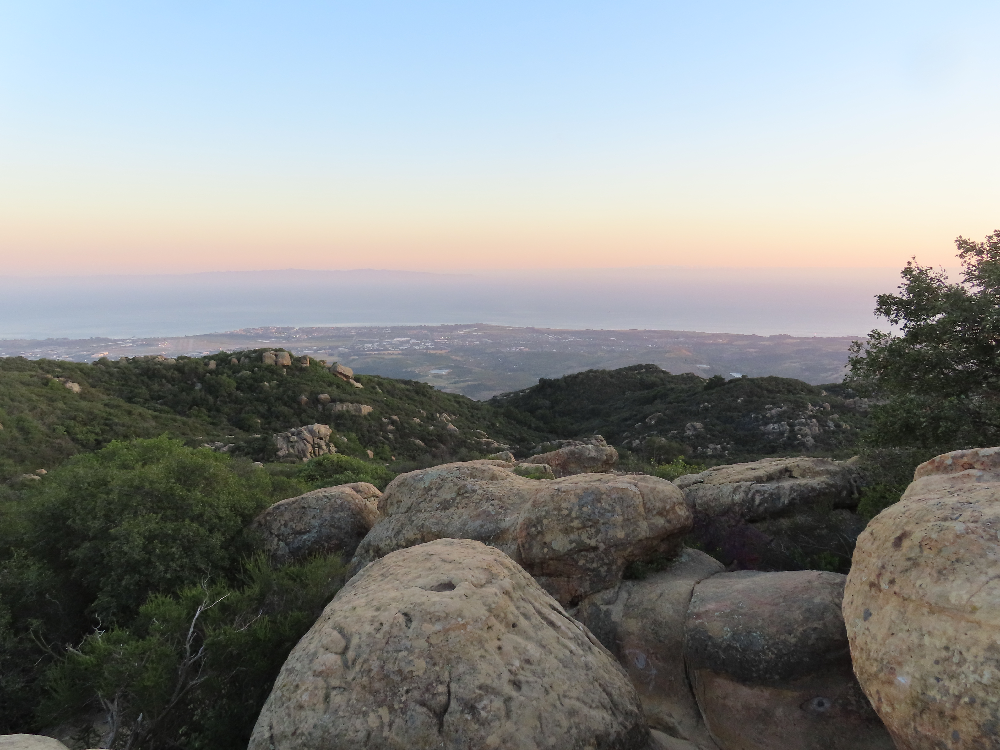

Santa Barbara is so gorgeous and I love all the outdoor nature spots and yummy food. Here are some of my favorites around Santa Barbara and Goleta.   

## Food & Drinks 🍽️

**Breakfast & Brunch**

- **Cristino's Bakery** — Really good breakfast burritos!
- **Jeannine's** — a classic SB brunch spot especially with an ocean view!
- **Chad's** — another favorite for a slow, delicious brunch! I recommend the huevos rancheros.
- **Mother of the Dough** — incredible sourdough bagels, worth the wait

**Coffee**

- **Lighthouse Coffee** — my go-to for matcha and lattes, perfect 
study spot

- **Caje**- super quick and great coffee that you can walk to in IV.

**Lunch**

- **Lazy Acres** — the sandwich and salad bar here is unbeatable for 
a healthy and delicious lunch

**Dinner & Drinks**

- **Finney's Craft House** — perfect for dinner and a drink with friends
- **Oku** — my favorite spot for sushi in SB

**Dessert**

- **Rori's Ice Cream** — the best ice cream in town, always worth it

**Bonus**

- **East Beach Tacos** — tacos AND batting cages? 

---

## Outdoor Spots 🌊

**Beach Days**

- **Butterfly Beach** — my favorite beach for a relaxed afternoon, 
beautiful and never too crowded
- **East Beach** — perfect for volleyball and soaking up the sun
- **Miramar Beach** — a hidden gem for a quiet beach day
- **More Mesa** — a walk along the bluffs followed by a trip down 
to the beach, one of the most beautiful spots in SB

**Walks & Hikes**

- **North Campus Open Space / Walk out to Sands** — a quick and 
beautiful walk right near IV,
- **Mesa Walk to Hendry's Beach** — one of my favorite loops, 
the views are so pretty 
- **Goleta Pier** — a fun walk with fishing, great for a slow evening
- **Lizard's Mouth** — the best sunset spot in all of Santa Barbara, 
especially for a picnic with friends

**Swimming & Exploring**

- **Red Rocks** — river exploring and swimming, the perfect summer day 
trip up into the mountains