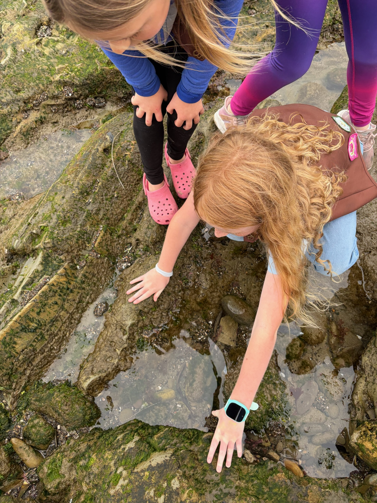
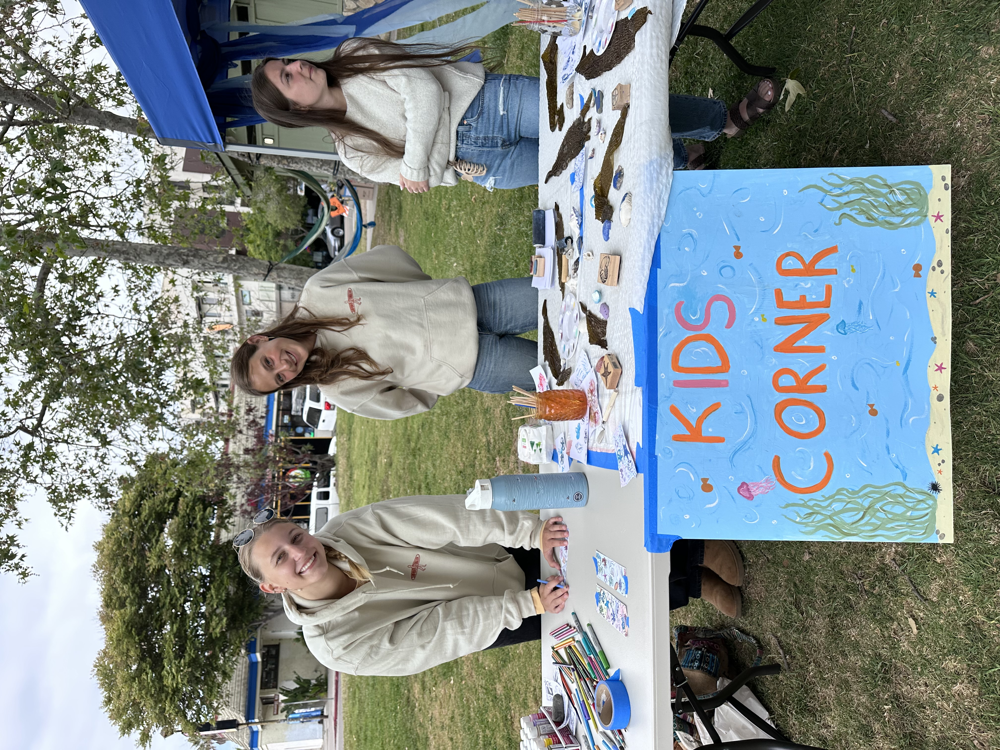
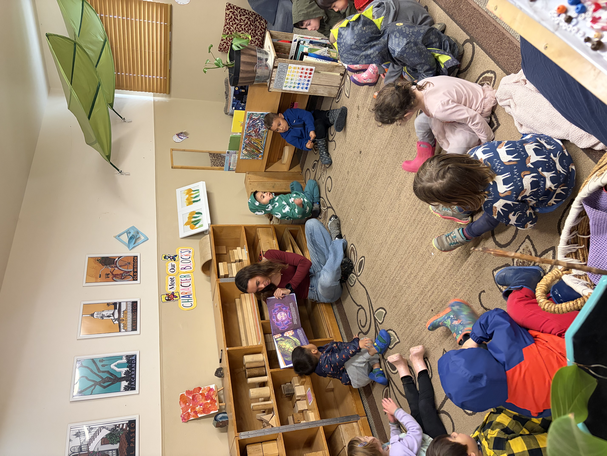

```{=html}
<div style="display: grid; grid-template-columns: repeat(3, 1fr); gap: 4px;">



</div>
```

## My Path in Environmental Education

Working directly with young people has been one of the most meaningful 
parts of my time at UCSB. Each of these roles has shaped my belief 
that hands-on, nature-based education is one of the most powerful 
tools we have for building a generation that cares about the environment.

## Leader, A-OK Afterschool Program
**Santa Barbara, CA | March 2025 – Present**

- Supervise and engage groups of 20+ children ages 4-12 in structured 
classroom-style activities
- Lead academic and enrichment activities while creating a positive 
and inclusive environment
- Communicate with staff and families to support student development

## Education Chair, Surfrider Isla Vista
**Santa Barbara, CA | September 2024 – Present**

- Develop and teach hands-on lessons on ocean health, coastal 
ecosystems, and marine conservation
- Create lesson plans and activities for elementary and middle 
school students

## Volunteer Staff, Wilderness Youth Project
**Santa Barbara, CA | January 2025 – Present**

- Assist in leading outdoor education such as wildlife tracking 
and plant identification
- Facilitate nature walks and field trips with nature-based learning 
for elementary-aged students


## Relevant Coursework

**ENVS 191 — Nature and Science Education Practicum**

Offered in conjunction with CCBER's Kids in Nature environmental 
education program, I gained hands-on experience teaching ecology 
and environmental science to youth while receiving instruction from 
professionals on science education, teaching strategies, lesson plan 
development, and public speaking.

**ENVS 127A — Foundations of Environmental Education**

An introduction to the underlying principles of environmental education, 
including the fundamental characteristics and goals of EE, the evolution 
of the field, instructional methodologies, and how to design, implement, 
and assess effective EE instruction across a variety of disciplines 
including nature connection, environmental justice, outdoor education, 
and primary, secondary, and higher education.

**ED 150 — Teaching and Teachers**

A foundational course exploring the nature of teaching as a specialized 
human activity and the organization and conduct of teaching in 
contemporary U.S. schools. This course helped me understand what 
it means to be an effective educator and how schools are structured 
to support student learning.