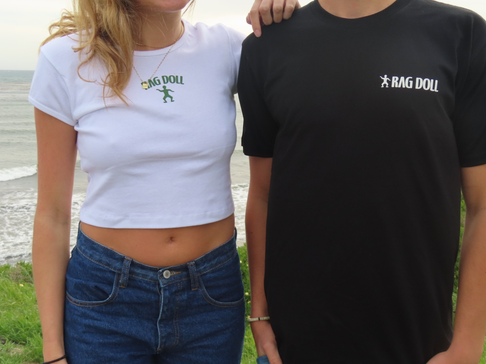
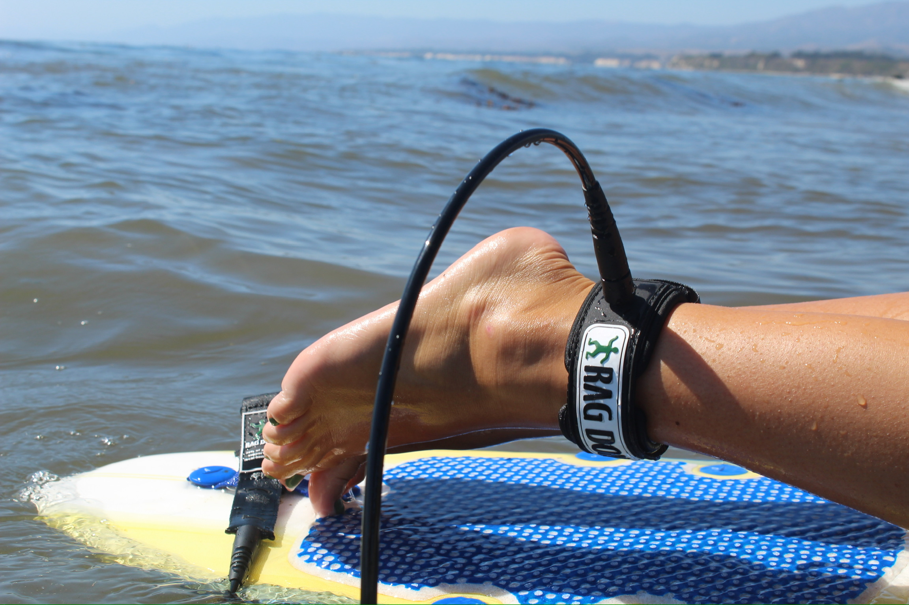
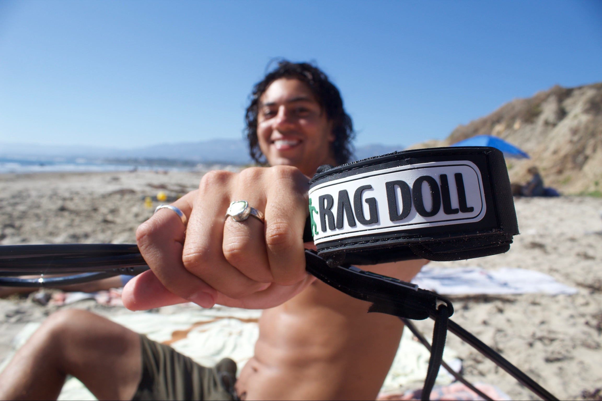

```{=html}
<div style="display: grid; grid-template-columns: repeat(3, 1fr); gap: 4px;">



</div>
```

## About Rag Doll Surf

I am part of a startup business called Rag Doll Surf, where I serve 
as the Merchandising and Social Impact Director. We started with a 
small product; Rag Doll leashes and have grown from there. I have 
helped design merchandise including women's and mens t-shirts and have helped 
run our Instagram to grow our following online.

## Our Mission

At Rag Doll, surfing isn't just a passion but a way of life that 
connects us to our community and the world around us. Growing up in 
Humboldt County, we have always loved the ocean and the sense of 
belonging it gives us. That is why we started Rag Doll: to make 
high-quality surf gear that is affordable and does some good along 
the way.

We are committed to giving back. That is why 20% of our profits go 
to helping California's homeless population. Growing up in Humboldt 
County, we saw firsthand how homelessness affects individuals and 
communities, and we wanted to do something about it. Our donations 
support programs that provide essentials like food and shelter, tackle 
addiction recovery, and create pathways for mental health support and 
employment opportunities.

At the core of everything we do is a belief that surfers deserve gear 
they can rely on without breaking the bank. When you buy from Rag Doll, 
you are not just getting great gear — you are helping us make a 
difference in the lives of others. Every wave ridden and every leash 
sold brings us one step closer to creating stronger communities and 
making a real difference.

We are also currently working to become members of 1% for the Planet, 
which will pledge at least one percent of our annual revenue to 
environmental initiatives that preserve and restore the world we cherish.

## Visit Us

Learn more about our mission and shop our products at Rag Doll Surf!

```{=html}
<a href="https://www.ragdollsurf.com/shop" target="_blank"
style="background-color: #7FB5C1; color: white; padding: 10px 20px;
border-radius: 8px; text-decoration: none; font-size: 16px;">
🏄 Shop Rag Doll Surf
</a>
```